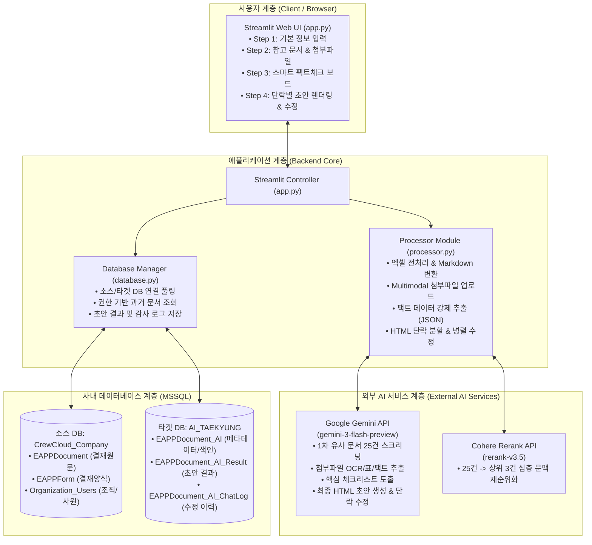
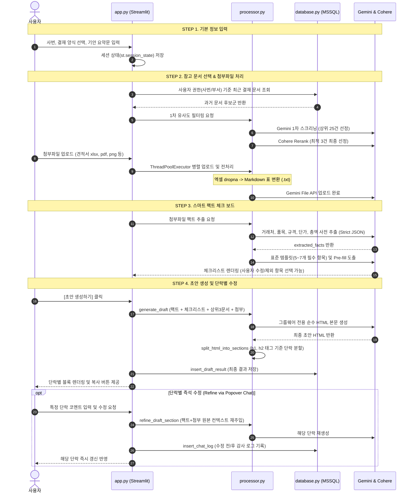

# 01. 시스템 아키텍처 및 상세 설계서 (Architecture & Design)

본 문서는 사내 그룹웨어 AI 기안/품의서 초안 생성 도우미의 전반적인 시스템 아키텍처, 데이터 흐름, 데이터베이스 스키마 및 모듈별 세부 설계를 기술합니다.

---

## 🏗️ 1. 전체 시스템 아키텍처

시스템은 사용자와 상호작용하는 **Streamlit 웹 애플리케이션 계층**, 비즈니스 로직 및 AI 파이프라인을 총괄하는 **코어 프로세서 계층**, 외부 고성능 AI 모델인 **Google Gemini & Cohere Rerank API 계층**, 그리고 사내 결재 데이터와 AI 생성 이력을 영구 보관하는 **MSSQL 데이터베이스 계층**으로 구성됩니다.



---

## 🔄 2. 사용자 워크플로우 4단계 상세 (STEP 1 ~ STEP 4)

사용자 편의성과 AI 생성 품질을 극대화하기 위해 4단계 마법사(Wizard) 방식으로 진행됩니다.



### 단계별 상세 기능 정의

| 단계 | 화면 명칭 | 주관 모듈 | 상세 동작 및 핵심 기능 |
| :--- | :--- | :--- | :--- |
| **STEP 1** | **기본 정보 입력** | `app.py` | • 사용자 사번 입력 (DB 권한 필터링 기준점)<br>• 기안 양식(기안, 보고, 구매, 검수 등) 드롭다운 선택<br>• 기안의 목적, 배경, 구매/추진 사유 등 사용자 자연어 요약문 작성 |
| **STEP 2** | **참고 문서 & 첨부파일** | `app.py`<br>`database.py`<br>`processor.py` | • 사내 DB에서 해당 사용자가 기안/결재/참조 권한을 가진 과거 3년 치 승인 문서 조회<br>• Gemini 1차 스크리닝(25건) ➔ Cohere Rerank(상위 3건) 2단계 필터링<br>• 첨부파일(견적서, 스크린샷, PDF) 비동기 병렬 전처리 및 Gemini File 서버 업로드 |
| **STEP 3** | **스마트 팩트체크 보드** | `processor.py`<br>`app.py` | • 첨부파일에서 공급처, 품목, 규격, 수량, 단가, 총액 데이터 사전 강제 추출 (Strict JSON)<br>• 기안서가 갖추어야 할 5~7대 표준 핵심 요소(체크리스트) 도출<br>• 확보된 정보는 Pre-fill(자동 입력), 부족한 항목은 사용자가 직접 입력하거나 AI 자동 채우기(Auto-fill) 위임<br>• 불필요한 항목은 체크 해제하여 초안에서 완전 제외 |
| **STEP 4** | **초안 생성 & 단락별 디테일 수정** | `processor.py`<br>`app.py`<br>`database.py` | • 수집된 모든 정보(팩트+체크리스트+과거문서 서식+첨부)를 융합하여 그룹웨어 표준 HTML 본문 생성<br>• HTML을 문단(`<h>`, `<h2>`) 단위로 자동 분할하여 단락별 카드 UI 제공<br>• 단락별 수정 지시(`st.popover`) 및 신규 단락 추가 기능 지원<br>• 수정 시 원본 팩트/첨부파일 재주입으로 환각 차단<br>• 결과 및 수정 전/후 내역을 DB에 완전 영구 보관 (감사 추적성 확보) |

---

## 🗄️ 3. 데이터베이스 설계 및 스키마 명세

시스템은 2대의 분리된 SQL Server를 사용합니다.

### 3.1. 소스 데이터베이스 (`CrewCloud_Company`)
- **역할:** 그룹웨어 실운영 트랜잭션 DB (Read-Only 조회)
- **주요 테이블:**
  - `EAPPDocument`: 결재 문서 마스터 (`ID`, `Title`, `Content`, `WriterID`, `DepartID`, `State`, `FormID`, `OperationDate` 등)
  - `EAPPForm`: 전자결재 양식 정의 (`ID`, `Name`, `EACode`, `IsUsing`)
  - `Organization_Users`: 조직 및 사원 정보 (`UserID`, `Name`, `DeptName1` 등)
- **보안 조회 원칙:**  
  타 부서의 대외비/보안 문서가 추천되지 않도록 `WriterID = ?` 또는 결재 라인/참조 부서 권한을 엄격히 체크하여 필터링합니다.

---

### 3.2. 타겟 데이터베이스 (`AI_TAEKYUNG`)
- **역할:** AI 분석 메타데이터 색인, 생성된 초안 결과 및 사용자 수정 감사 로그 저장 (Read/Write)

#### (1) `EAPPDocument_AI` (유사 문서 검색용 메타데이터 색인 테이블)
과거 승인된 결재 문서를 배치(`gw_ai.py`)로 분석하여 주요 키워드와 요약문을 사전 생성해 둔 인덱스 테이블입니다.

```sql
CREATE TABLE EAPPDocument_AI (
    ID INT PRIMARY KEY,                 -- 결재 문서 ID (EAPPDocument.ID)
    Title NVARCHAR(500),                -- 문서 제목
    WriterID NVARCHAR(50),              -- 기안자 사번
    Writer NVARCHAR(50),                -- 기안자 이름
    DepartID NVARCHAR(50),              -- 기안 부서 코드
    DeptName1 NVARCHAR(100),            -- 기안 부서명
    RegDate DATETIME,                   -- 등록 일시
    Keywords NVARCHAR(MAX),             -- AI 추출 핵심 키워드 (오류 시 'ERROR')
    Summary NVARCHAR(MAX),              -- AI 생성 3줄 핵심 요약
    IsDelete BIT DEFAULT 0,             -- 삭제 여부
    FormName NVARCHAR(40),              -- 결재 양식명
    EACode NVARCHAR(20)                 -- 결재 양식 코드
);
```

#### (2) `EAPPDocument_AI_Result` (최종 AI 생성 결과 보관 테이블)
사용자가 4단계에서 생성한 최종 초안과 당시 입력된 메타 파라미터를 영구 기록합니다.

```sql
CREATE TABLE EAPPDocument_AI_Result (
    No INT IDENTITY(1,1) PRIMARY KEY,   -- 고유 식별 번호
    RequesterID NVARCHAR(50),           -- 기안 요청자 사번
    FormName NVARCHAR(100),             -- 결재 양식명
    DocSummary NVARCHAR(MAX),           -- 사용자가 1단계에 입력한 요청 요약
    UploadedFiles NVARCHAR(MAX),        -- 업로드된 첨부파일명 목록 (JSON 배열 문자열)
    EssentialAnswers NVARCHAR(MAX),     -- 3단계 체크리스트 질문/답변 (JSON)
    ExtractedFacts NVARCHAR(MAX),       -- 첨부파일에서 추출된 사전 팩트 (JSON)
    RequestContent NVARCHAR(MAX),       -- 종합 프롬프트 내용
    RefDocID1 INT,                      -- 참고 문서 1 ID
    RefDocTitle1 NVARCHAR(500),         -- 참고 문서 1 제목
    RefDocScore1 FLOAT,                 -- 참고 문서 1 Rerank 점수
    RefDocID2 INT,                      -- 참고 문서 2 ID
    RefDocTitle2 NVARCHAR(500),         -- 참고 문서 2 제목
    RefDocScore2 FLOAT,                 -- 참고 문서 2 Rerank 점수
    RefDocID3 INT,                      -- 참고 문서 3 ID
    RefDocTitle3 NVARCHAR(500),         -- 참고 문서 3 제목
    RefDocScore3 FLOAT,                 -- 참고 문서 3 Rerank 점수
    ResultContent NVARCHAR(MAX),        -- 최종 생성된 초안 HTML
    CreatedAt DATETIME DEFAULT GETDATE()-- 생성 일시
);
```

#### (3) `EAPPDocument_AI_ChatLog` (단락별 채팅 수정 이력 및 감사 로그 테이블)
사용자가 초안 생성 후 단락별로 수정한 모든 대화와 텍스트 변화를 추적합니다.

```sql
CREATE TABLE EAPPDocument_AI_ChatLog (
    LogID INT IDENTITY(1,1) PRIMARY KEY,-- 로그 ID
    ResultID INT,                       -- 연관 EAPPDocument_AI_Result.No
    UserMessage NVARCHAR(MAX),          -- 사용자의 수정 지시 메시지
    BeforeDraft NVARCHAR(MAX),          -- 수정 전 단락/문서 HTML
    AfterDraft NVARCHAR(MAX),           -- 수정 후 단락/문서 HTML
    CreatedAt DATETIME DEFAULT GETDATE()-- 수정 일시
);
```

---

## 🧩 4. 주요 모듈 및 인터페이스 명세

### 4.1. `processor.py` (`Processor` 클래스)
AI 처리, RAG, 전처리 및 후처리를 담당하는 핵심 모듈입니다.

| 메서드명 | 입력 파라미터 | 반환값 | 기능 설명 |
| :--- | :--- | :--- | :--- |
| `upload_file` | `file_path`, `wait_active=True` | `File` (Gemini 파일 객체) | 엑셀 파일은 `pandas`로 빈 행/열 dropna 후 마크다운 표(`.txt`)로 변환, 기타 파일은 직접 Gemini File API로 업로드 |
| `extract_attachment_facts` | `attachments` (파일 객체 리스트) | `str` (JSON 문자열) | 첨부파일에서 거래처, 품목, 규격, 수량, 단가, 총액 데이터 사전 강제 추출 |
| `find_top_25_similar` | `user_request`, `documents`, `form_name` | `list` (선별된 문서 리스트) | 1차 검색: 과거 문서 수백 건 중 사용자의 기안 목적과 가장 유사한 상위 25건을 Gemini가 스크리닝 |
| `rerank_to_top_3` | `search_query`, `top25_documents`, `threshold` | `list` (최상위 3건 리스트) | 2차 검색: Cohere Rerank API를 이용해 의미적 일치도가 가장 높은 최적 3건을 점수와 함께 도출 |
| `generate_essential_checklist` | `user_request`, `top3_contents`, `extracted_facts`, `attachments` | `str` (JSON 문자열) | 표준 템플릿(5~7개 필수 항목)을 정의하고 확보된 정보를 Pre-fill한 스마트 체크리스트 생성 |
| `generate_draft` | `user_request`, `top3_contents`, `use_web_search`, `extracted_facts`, `attachments`, `essential_answers`, `excluded_items` | `str` (HTML 본문) | 모든 컨텍스트와 네거티브 프롬프트(제외 항목)를 결합하여 그룹웨어 표준 순수 HTML 초안 생성 |
| `split_html_into_sections` | `html_content` | `list` (단락 HTML 리스트) | 생성된 HTML을 `<h1>`, `<h2>`, `<h3>` 태그 기준으로 논리적 단락으로 분할 |
| `refine_draft_section` | `section_html`, `user_message`, `full_draft`, `extracted_facts`, `attachments` | `str` (수정된 단락 HTML) | 특정 단락에 대해 전체 문서 문맥과 원본 팩트 데이터를 재주입하여 일관성 있게 단락 재생성 |
| `generate_new_section` | `section_title`, `instruction`, `full_draft`, `extracted_facts`, `attachments` | `str` (신규 단락 HTML) | 사용자가 지시한 제목과 가이드에 맞추어 전체 초안 문맥에 어울리는 새로운 단락 추가 생성 |

---

### 4.2. `database.py` (`DatabaseManager` 클래스)
MSSQL 커넥션 관리 및 쿼리 실행을 캡슐화한 클래스입니다.

| 메서드명 | 입력 파라미터 | 반환값 | 기능 설명 |
| :--- | :--- | :--- | :--- |
| `connect` | 없음 | `pyodbc.Connection` | `config.py`의 접속 정보를 바탕으로 ODBC 연결 수립 |
| `fetch_all_with_params` | `query`, `params` | `columns`, `rows` | SQL 인젝션을 방지하는 파라미터 바인딩 쿼리 실행 및 컬럼/로우 튜플 반환 |
| `insert_draft_result` | `requester_id`, `request_content`, `ref_docs`, `result_content`, ... | `int` (생성된 Result No) | `EAPPDocument_AI_Result` 테이블에 결과 레코드 삽입 후 `@@IDENTITY` 반환 |
| `insert_chat_log` | `result_id`, `user_message`, `before_draft`, `after_draft` | 없음 | 사용자의 단락별 수정 지시 내역 및 수정 전/후 HTML을 감사 로그 테이블에 영구 보관 |

---

### 4.3. `app.py` (Streamlit Presentation Controller)
사용자 UI 및 전체 상태 머신(State Machine)을 제어합니다.
- `st.session_state.step`: 현재 진행 단계 (1~4)
- `st.session_state.uploaded_gemini_files`: 업로드 완료된 Gemini 파일 핸들러 리스트
- `st.session_state.essential_fields`: 3단계에서 도출된 필수 체크리스트 항목
- `st.session_state.draft_sections`: 4단계에서 분할된 단락별 HTML 블록 리스트
- `st.cache_resource`: `Processor` 및 `DatabaseManager`의 전역 싱글톤 인스턴스 관리

---

### 4.4. `gw_ai.py` (Batch Indexer)
- 매일/매주 단위로 신규 승인된 과거 결재 문서를 가져와 Gemini를 통해 요약 및 키워드를 생성하고, 타겟 DB `EAPPDocument_AI`에 색인하는 백그라운드 배치 프로세스입니다.
- 실패 레코드(`Keywords='ERROR'`)는 차후 재시도 대상에 자동으로 포함되도록 설계되어 있습니다.
