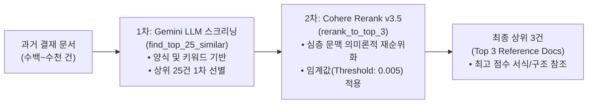
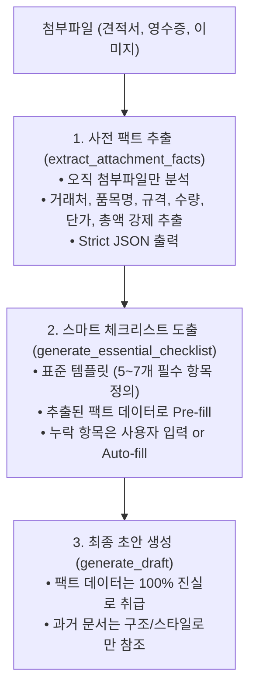

# 02. AI 파이프라인 및 프롬프트 엔지니어링 가이드 (AI Pipeline & Prompts)

본 문서는 사내 그룹웨어 AI 기안/품의서 초안 생성 도우미의 핵심 AI 파이프라인 동작 원리, 데이터 전처리 규칙, 프롬프트 엔지니어링 구조 및 환각(Hallucination) 통제 전략을 기술합니다.

---

## 🎯 1. 2단계 하이브리드 RAG (검색 증강 생성) 파이프라인

수백~수천 건의 사내 과거 결재 문서 중에서 사용자의 현재 기안 의도와 가장 일치하는 최적의 참고 양식 3건을 빠르고 정확하게 선별하기 위해 **Gemini 1차 스크리닝 + Cohere 2차 리랭킹** 2단계 파이프라인을 구축했습니다.



### 1.1. 1차 필터링: Gemini LLM 기반 상위 25건 추출 (`find_top_25_similar`)
- **목적:** 대량의 과거 문서 메타데이터(제목, 작성자, 양식명, 요약) 중 기안 목적과 유사한 후보군을 빠르게 압축.
- **동작 방식:**
  - 사용자 권한 내의 과거 문서 목록을 JSON 문자열 형태로 Gemini에 전달.
  - LLM이 의도와 양식 매칭도를 기준으로 판단하여 상위 최대 25개의 `ID` 배열을 반환.

### 1.2. 2차 필터링: Cohere Rerank API 기반 상위 3건 최종 선별 (`rerank_to_top_3`)
- **목적:** 단순 키워드 겹침을 넘어, 실제 문서 본문의 비즈니스 문맥(Semantic Context) 일치도가 가장 높은 상위 3건 선정.
- **동작 방식:**
  - 사용자의 요청 텍스트(`search_query`)와 1차에서 선별된 25개 문서의 본문 마크다운 텍스트를 Cohere `rerank-v3.5` 모델에 주입.
  - 반환된 `relevance_score`를 기반으로 정렬한 뒤, 상위 3개 문서만 슬라이싱하여 세션에 보관.
  - 4단계 화면에서는 이 3개 문서의 제목과 Rerank 유사도 점수(0.00 ~ 1.00)를 사용자에게 투명하게 공개합니다.

---

## 🛡️ 2. 첨부파일 전처리 파이프라인 (절대 불변 규칙)

> [!CAUTION]
> ### 🚨 첨부파일 파싱 로직 보존 불변 지침 (Preservation Rule)
> `processor.py`의 `upload_file()` 메서드 내부에 위치한 **엑셀(.xlsx) 파일의 마크다운 표 변환 로직**은 복잡한 셀 병합, 공백 행/열로 인한 LLM의 숫자 오독 및 테이블 붕괴를 완벽히 해결한 **검증된 핵심 로직**입니다.  
> 어떠한 경우에도 이 변환 파이프라인을 훼손하거나 원본 엑셀 바이너리를 그대로 LLM에 직접 주입해서는 안 됩니다.

### 2.1. 엑셀 파일 전처리 (`upload_file` 내부 동작)
일반적인 멀티모달 LLM은 공공기관이나 기업의 복잡한 엑셀 견적서(병합된 셀, 빈 여백 행, 다중 표)를 직접 읽을 때 열 인덱스가 뒤틀리거나 단가/수량을 엉뚱한 행에 매칭하는 치명적 환각이 발생합니다.

이를 방지하기 위해 다음 알고리즘을 적용합니다:
1. `pandas.read_excel(file_path, sheet_name=None, header=None)`로 모든 시트를 원본 그대로 로드.
2. `df.dropna(how='all', axis=1).dropna(how='all', axis=0).fillna("")`를 통해 **완전히 비어 있는 행과 열을 모두 제거**하여 데이터 밀도를 극대화.
3. 데이터프레임의 모든 개행문자(`\n`)와 파이프(`|`) 특수문자를 정제.
4. 모든 시트를 순회하며 깔끔한 **마크다운 표(Markdown Table)** 문자열로 변환.
5. 변환된 텍스트를 임시 파일(`.txt`)로 저장한 뒤 Gemini File API에 업로드 (`self.client.files.upload`).
6. 업로드 완료 후 임시 텍스트 파일은 즉시 안전하게 삭제.

### 2.2. 이미지/PDF 파일 처리
- 영수증 스크린샷, 쇼핑몰 장바구니 이미지(`png`, `jpg`), PDF 제안서는 Gemini의 고성능 비전/멀티모달 기능으로 직접 업로드 처리.
- `wait_for_file_active()`를 통해 대용량 PDF나 이미지의 Gemini 서버 인덱싱 상태(`PROCESSING` -> `ACTIVE`)를 능동적으로 대기하여 API 에러를 사전 방지.

---

## 🔍 3. 사전 팩트 추출 (Fact Extraction) 및 스마트 체크리스트

과거 결재 문서의 서식에 내용을 맞추다 보면 과거 문서의 과거 금액이나 과거 품목이 초안에 섞여 들어가는 오류(스타일 오염 현상)가 발생할 수 있습니다. 이를 막기 위해 **2단계 분리 전략**을 사용합니다.



### 3.1. 사전 팩트 추출 (`extract_attachment_facts`)
- **원리:** 과거 결재 문서는 일체 배제하고 오직 사용자가 올린 첨부파일만 대상으로 JSON 데이터를 강제 추출.
- **반환 스키마:**
```json
{
  "supplier": "거래처 또는 판매처 상호명",
  "items": [
    {
      "name": "품명 및 모델명",
      "spec": "규격 및 옵션",
      "unit": "단위(EA, 개, 대 등)",
      "quantity": "수량",
      "price": "단가",
      "total_amount": "금액"
    }
  ]
}
```

### 3.2. 스마트 체크리스트 생성 (`generate_essential_checklist`)
- 사용자의 기안 요약문, 상위 3개 참고 문서 구조, 그리고 사전 추출된 팩트 데이터를 종합하여 기안서 작성을 위해 반드시 갖추어야 할 5~7개의 핵심 뼈대 항목을 정의.
- **Pre-fill 메커니즘:** 첨부파일이나 요약문에서 확인된 정보(예: 거래처, 총금액 등)는 자동으로 답변란에 입력되어 제공.
- **Auto-fill 메커니즘:** 사용자가 답변을 빈칸으로 둘 경우, AI가 비즈니스 관례와 문맥에 맞추어 지능적으로 자동 채움.
- **제외 처리 (`excluded_items`):** 사용자가 불필요하다고 체크 해제한 항목은 초안 생성 프롬프트에 명시적인 네거티브 프롬프트로 주입되어 완전히 제거됨.

---

## 📝 4. 초안 생성 및 단락별 즉석 수정 (Section Refinement)

### 4.1. 초안 생성 (`generate_draft`)
- **출력 형식 강제:** 사내 그룹웨어 에디터에 붙여넣기(Ctrl+V) 시 레이아웃 깨짐이 없도록 `<html>`, `<body>`, ```html 백틱을 엄격히 금지하고 **순수 본문 HTML 태그(`<h2>`, `<table>`, `<ul>`, `<p>`)**만 출력.
- **스타일 인라인 적용:** 그룹웨어 전용 표준 CSS 인라인 스타일(테이블 border, background `#f8f9fa`, 패딩 등)을 강제 주입.
- **헤딩 태그 강제:** 단락 분할을 위해 반드시 `<h2>` 태그로 각 단락을 명확히 구분하도록 프롬프트에 지시.

### 4.2. 단락 분할 알고리즘 (`split_html_into_sections`)
생성된 전체 HTML 텍스트를 정규식 기반으로 분할합니다:
```python
# processor.py line 523
pattern = r'(?=<h[1-3][^>]*>)'
sections = re.split(pattern, html_content, flags=re.IGNORECASE)
```
이 분할 로직을 통해 4단계 화면에서 초안이 개별 카드 위젯으로 나뉘어 렌더링됩니다.

### 4.3. 단락별 즉석 수정 (`refine_draft_section`) 및 환각 차단 (Context Re-injection)
- 사용자가 특정 단락 우측 하단의 `[💬 Comment]` 팝업을 통해 "금액 단위를 부가세 포함으로 바꿔줘" 또는 "항목을 불릿 기호로 정리해 줘" 등의 명령을 내립니다.
- **환각 차단 핵심 (Context Re-injection):**
  - 수정 시 해당 단락만 떼어서 LLM에 보내면 앞뒤 문맥이 깨지거나, 기존의 고유 명사/숫자가 왜곡됩니다.
  - 따라서 프롬프트에 **① 수정 대상 단락**, **② 전체 기안서 초안 텍스트(Full Context)**, **③ 사전 추출된 원본 팩트 데이터(Extracted Facts)**, **④ 원본 첨부파일**을 다시 주입합니다.
  - 이를 통해 "상세 내용을 요약해 줘" ➔ "다시 원래대로 자세히 복원해 줘"와 같은 반복 수정 상황에서도 원본 데이터의 손실이나 환각이 발생하지 않습니다.

### 4.4. 단락별 도출 근거 (Grounding Sources) 및 웹 출처 표기
- 사용자가 4단계에서 각 단락의 내용이 어떤 근거로 작성되었는지 신뢰할 수 있도록 단락별 도출 근거 아코디언(`<details>`)을 동적으로 생성합니다.
- **매칭 알고리즘:** 단락의 제목(`<h>` 텍스트)과 3단계 체크리스트 핵심 키워드 간의 단어 일치율이 50% 이상일 때만 매칭하여 오매칭(False-positive)을 원천 차단했습니다.
- **웹 검색 출처:** Gemini API 호출 시 전달받은 `grounding_metadata`를 파싱하여, AI가 웹 검색을 참고한 경우 실제 사이트 제목과 URL 링크(`<a href=...>` 태그)를 사용자에게 명확히 제시합니다.

---

## 📑 5. 프롬프트 엔지니어링 명세

### 5.1. 의도 파악 프롬프트 (`check_request_intent`)
```text
당신은 사내 그룹웨어 전자결재 시스템의 AI 어시스턴트입니다.
사용자의 입력 문장을 분석하여, 이것이 기안서나 품의서 같은 '전자결재 문서 작성(또는 초안 작성)'을 요구하는 명령어인지 파악해주세요.

지시사항:
1. 문서 작성(또는 관련 데이터 검색 후 작성) 요구라면 "is_draft_request": true 로 설정.
2. 단순 질문, 인사, 일상 대화라면 "is_draft_request": false 로 설정하고 "response_message" 작성.
반환 포맷: Strict JSON
```

### 5.2. 첨부파일 팩트 추출 프롬프트 (`extract_attachment_facts`)
```text
사용자가 업로드한 첨부파일(견적서, 쇼핑몰 장바구니 스크린샷, 영수증 등)을 정밀 분석하여 다음 정보를 추출하세요.
1. 거래처/판매처 상호명
2. 품목 리스트 (품명, 규격/옵션, 단위, 수량, 단가, 총금액)
반환 포맷: Strict JSON ({ supplier: ..., items: [...] })
규칙: 이미지 및 문서에 있는 실제 숫자와 품목명만을 절대적으로 신뢰하고 정확하게 추출할 것.
```

### 5.3. 초안 생성 프롬프트 (`generate_draft`) 핵심 지침
```text
당신은 그룹웨어 전자결재 기안서/품의서 전문 작성 AI 어시스턴트입니다.
주어진 [사용자 요청], [체크리스트 정보], [사전 추출 팩트 데이터], [참고 과거 결재 문서], [첨부파일]을 종합하여
완벽한 비즈니스 전자결재 본문 HTML을 생성하세요.

[절대 불변 규칙]
1. 순수 HTML 본문 태그(<h2>, <p>, <table>, <ul>, <li>)만 출력할 것.
   - ```html 백틱, <html>, <body> 태그 절대 사용 금지.
2. 각 문단은 반드시 <h2> 태그로 시작하여 명확히 구분할 것.
3. 금액, 수량, 품목은 [사전 추출 팩트 데이터]를 100% 진실로 취급하여 반영할 것.
   - 과거 참고 문서에 있는 금액이나 품목명은 절대 혼동하여 가져오지 말 것.
4. [제외된 항목]에 기재된 항목은 과거 문서에 존재하더라도 본문에 절대 생성하지 말 것.
5. 테이블(table)은 비즈니스 표준 스타일을 인라인 CSS로 적용할 것.
   (border-collapse: collapse; width: 100%; th 배경색: #f2f2f2; border: 1px solid #ddd;)
```
