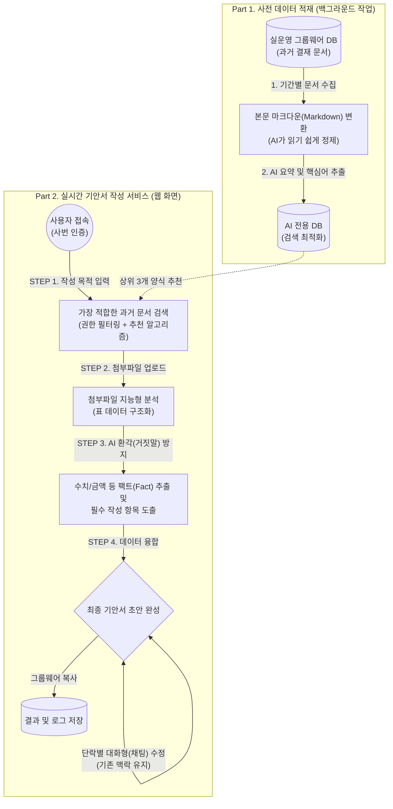

# 🚀 GW AI (기안서 자동 작성 시스템) 현황 분석 및 중장기 로드맵

본 문서는 사내 기안서 자동 작성 AI 시스템의 **현재 구동 방식**을 정의하고, 적용된 **핵심 기술의 비즈니스 가치**를 평가하며, 향후 엔터프라이즈 환경에 맞게 고도화해야 할 **개선 및 신규 기획 방향**을 전문가와 실무자 모두가 이해하기 쉽게 정리한 보고서입니다.

---

## 1. 시스템 구동 방식 및 아키텍처 (Architecture)

현재 시스템은 대규모 과거 데이터를 사전에 가공해 두는 **[사전 데이터 적재(Batch)]** 단계와, 사용자가 직접 상호작용하는 **[실시간 웹 서비스]** 단계의 투트랙(Two-track) 구조로 운영됩니다.

 

---

## 2. 현재 구현된 핵심 기능과 비즈니스 가치 (Core Features)
> 현재 시스템은 사용자의 작성 시간을 단축하기 위해 다음과 같은 지능형 기술들을 탑재하고 있습니다.

| 핵심 기술 | 비즈니스 가치 및 쉬운 설명 |
| :--- | :--- |
| **💡 과거 문서 맞춤형 추천 (RAG 알고리즘)** | 사용자의 작성 목적에 맞춰 가장 적합한 과거 결재 문서를 찾아 양식과 문체를 적용합니다. *(백지상태에서 시작하는 막막함을 해소하고 사내 표준 서식을 유지합니다.)* |
| **📊 첨부파일 지능형 전처리 (Data Parsing)** | 엑셀 등 복잡한 표 데이터를 AI가 이해하기 쉬운 형태(마크다운)로 자동 정제합니다. *(AI가 숫자를 헷갈리거나 표 구조를 누락하는 인식 오류를 방지합니다.)* |
| **🛡️ 수치 창작(환각) 원천 차단 (Fact Extraction)** | AI가 임의로 금액이나 수량을 지어내는 현상을 막기 위해, 원본 파일에서 정확한 팩트(숫자, 고유명사)만 별도로 뽑아내어 기안서에 주입합니다. *(돈과 관련된 치명적인 오류를 원천 차단합니다.)* |
| **💬 문단 단위 대화형 수정 (Context Injection)** | 완성된 기안서를 한 번에 엎지 않고, 원하는 특정 단락만 채팅을 통해 세밀하게 수정할 수 있습니다. *(전체 문맥을 잃지 않으면서 사용자의 의도대로 정교한 편집이 가능합니다.)* |

 

---

## 3. 기존 기능의 개선 및 고도화 방향 (Functional Improvements)
> 현재 탑재된 기능들의 완성도를 엔터프라이즈급으로 끌어올리기 위해 필요한 기능적 개선 사항입니다.

| 기능 카테고리 | 현재 구현 상태 | 🚀 향후 개선 및 고도화 방향 |
| :--- | :--- | :--- |
| **과거 문서 추천 (RAG 검색)** | 텍스트(키워드) 중심의 유사도 검색 후 상위 3개 도출 | 단순 키워드를 넘어 문장의 숨은 맥락까지 이해하는 **하이브리드 검색(Vector DB)** 도입으로 추천 정확도 극대화 |
| **초안 생성 및 UI 경험** | 기안서 초안 전체가 완성될 때까지 로딩 화면 멈춤 대기 | **실시간 스트리밍(Streaming UI)** 방식을 도입해 ChatGPT처럼 한 글자씩 보여주어 체감 대기시간 제로화 |
| **첨부파일 분석 (Parsing)** | 엑셀(표 데이터)과 텍스트 문서 위주의 전처리 최적화 | **PDF 내의 복잡한 표나 이미지 스캔 문서(OCR 연동)**까지 AI가 정밀하게 인식하도록 파싱 범위 확장 |
| **팩트(Fact) 주입** | 추출된 숫자/금액을 단순히 텍스트 문장으로 녹여냄 | 추출된 수치가 사내 표준 템플릿의 **특정 입력 폼(표 안의 빈칸 등)에 정확히 매핑(Pre-fill)**되도록 정밀도 향상 |

 

---

## 4. 인프라 및 신규 기능 도입 과제 (Infra & New Features)
> 향후 시스템의 안정성을 확보하고 자체 진화하는 AI를 만들기 위한 필수 도입 과제입니다.

> [!WARNING]
> **1. 보안 및 인증 체계 강화 (사칭 및 정보 유출 방지)**
> - **인증**: 수동 사번 입력 방식을 폐지하고 사내 그룹웨어 **자동 로그인(SSO)** 연동 도입 필수.
> - **정보 보호**: 첨부파일 내 주민번호, 계좌번호 등을 외부 AI로 전송하기 전 미리 `***`로 치환하는 **개인정보 비식별화(PII Masking)** 도입.

> [!CAUTION]
> **2. 시스템 안정성 확보 (API 통신 재시도 로직)**
> - 대용량 파일 분석 중 구글 API 통신 제한(Rate Limit)으로 인한 오류 시, 프로그램이 중단되지 않고 스스로 대기 후 다시 시도하는 **지수 백오프(Exponential Backoff)** 복구 기능 적용.

> [!NOTE]
> **3. 대규모 데이터 적재 및 자체 진화 시스템 구축**
> - **데이터 적재(Batch)**: 3년 치 등 방대한 과거 데이터를 월별/분기별로 나누어(Chunking) 서버 과부하 없이 안전하게 순차 적재하는 스크립트 고도화.
> - **피드백 루프(Feedback)**: 결과물에 대한 사용자의 평가(좋아요/수정 내역)를 모아, 시간이 지날수록 AI가 우리 회사만의 작성 스타일을 완벽하게 학습하는 로직 설계.
